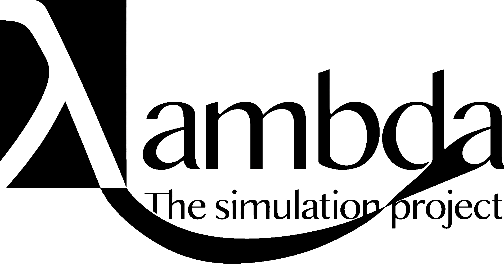

<h1 align="center">
    <a href="">
        <picture>
          <source media="(prefers-color-scheme: dark)">
          
        </picture>
    </a>
    <br>
    <small>With the ultimate goal of informing and improving decision making</small>
</h1>

🌐 This GitHub project is currently a solo venture aimed at simulating and visualizing complex systems in order to make better decisions.

<!-- 🌱 It starts simply with an agent moving randomly and eating randomly generated food, laying the foundation for emergent complexity. -->

👥 The repository serves as a starting point where the end goal is to simulate macroeconomic effects in society by utilizing the merits of <a href= "https://en.wikipedia.org/wiki/Agent-based_model">agent based modeling</a>.
🏙️ I.e. testin potential outcomes of various economic/political policies on simulated "agents".

🎨The simulation seeks to be both visually informative aspects easily editable parameters enableing a rapid human in the loop system.

<!--🔥Targeting a wide audience, from friends to industry professionals,
and aims to ignite a passion for complex adaptive systems.
-->

<p>🤝 Feel free to <a href="mailto:larshalvorhansen1@gmail.com">get in touch</a> if you want to collaborate or give feedback!</p>

<!--
Here is a tree structure of this project as of 16.10.2024:
```plaintext
.
├── bookmark.md
├── lambdaQwen
│   ├── __pycache__
│   │   └── model.cpython-312.pyc
│   ├── data.py
│   ├── main.py
│   ├── model.py
│   └── shell.nix
├── learning
│   ├── data_and_programsFromLou2022
│   │   ├── ar
│   │   ├── calibration
│   │   ├── data
│   │   ├── figs
│   │   ├── model
│   │   ├── model_scaled
│   │   └── tabs
│   ├── learningNetlogo
│   │   ├── '# NetLogo 6.4.md'
│   │   ├── first.nlogo
│   │   └── Untitled-2.sty
│   ├── learningR
│   │   ├── CourseFiles
│   │   ├── read.md
│   │   └── test.r
│   ├── learnOptimizationFromMit
│   │   ├── code.jl
│   │   ├── code.py
│   │   └── notes.md
│   └── XGBoost
│       └── 1.jl
├── mainProject
│   ├── Adjustments
│   ├── Comparison
│   │   └── README.md
│   ├── DataPipeline
│   │   ├── 2dsim.py
│   │   ├── basicGet.py
│   │   ├── CleaningAndFormatting
│   │   ├── Collection
│   │   ├── data.db
│   │   ├── flake.lock
│   │   ├── flake.nix
│   │   ├── gdp_fetch.log
│   │   ├── gdp_per_capita.db
│   │   ├── getOECD.py
│   │   ├── getWB.py
│   │   ├── Labeling
│   │   ├── Processing
│   │   └── README.md
│   ├── FinalModel
│   │   └── README.md
│   ├── Model
│   │   ├── Agents
│   │   ├── InitialConditions
│   │   ├── NodesAndRelations
│   │   ├── Output
│   │   ├── README.md
│   │   ├── Result
│   │   └── Simulation
│   ├── predictionPipelineV2.png
│   └── README.md
├── mesatest
│   ├── firstMesa.py
│   ├── mesaButNoMesa
│   │   └── test.py
│   └── shell.nix
├── plan
│   ├── egendefinert
│   │   ├── finalReportMal.md
│   │   ├── fremdriftsrapport.md
│   │   └── retningslinjer.md
│   ├── OBSpredictionVariabler.png
│   ├── oldPlans
│   │   ├── obsVariabler.md
│   │   ├── plan.md
│   │   ├── plan2.md
│   │   └── TrondAndresenPlan2025.md
│   ├── planForIdag.md
│   ├── predictionPilelineDiagramV1.pdf
│   └── predictionPipelineV2.png
├── project
│   ├── approachUsingCellularAutomata
│   │   ├── circleEatingFood.py
│   │   ├── gameOfLife.py
│   │   ├── gameOfLifeWithAgeColors.py
│   │   ├── redMovingCircle.py
│   │   └── reynoldsFlockingModel.py
│   ├── approachUsingModules
│   │   ├── gui.jl
│   │   ├── gui.py
│   │   ├── hei.cpp
│   │   ├── modsynth.cpp
│   │   ├── rules.jl
│   │   └── test.cpp
│   ├── bigDatabase
│   │   ├── md.md
│   │   └── test.sql
│   ├── blobEatingSim
│   │   └── simple.py
│   ├── finnIntrinsicValueEstimator
│   │   ├── data
│   │   ├── data5.csv
│   │   ├── finn_koder.csv
│   │   ├── finn_seach_scrape.html
│   │   ├── main.py
│   │   ├── README.md
│   │   ├── test.html
│   │   └── test2.py
│   ├── grassSim
│   │   ├── agents.py
│   │   ├── agents2.py
│   │   ├── data
│   │   ├── enterprateData.py
│   │   ├── p4e.py
│   │   └── writeRandomData.py
│   ├── logo
│   │   ├── lambdasimWallpaper-min.png
│   │   ├── logoGeneratorSim.py
│   │   ├── logoGraphic
│   │   ├── PixelnatorLogoSim.zip
│   │   ├── SimProsjektLogo.png
│   │   └── smallLambda.png
│   ├── practicalConcepts
│   │   └── doublePendulum.py
│   ├── proggeloggeTemp
│   │   └── gui.py
│   ├── relationalDatabase
│   │   ├── calc.py
│   │   ├── commoditiesData
│   │   └── README.md
│   ├── synthAndABM.py
│   └── vcvApproach
│       ├── cApproach
│       ├── cApproach2
│       ├── prototype1.py
│       ├── prototype2.py
│       ├── prototype3.py
│       ├── prototype4.py
│       ├── prototype5.py
│       ├── shell.nix
│       └── simpletype5.py
├── README.md
├── Research-Plan.md
├── shell.nix
└── thesis
    ├── thougths.pdf
    └── thougths.typ
-->
