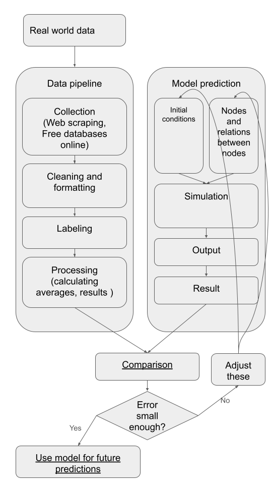

# 📊 Model Project Overview

The main project follows the structure in the diagram below:

 <!-- Replace with actual image path or markdown image syntax -->

---

## 🔄 Project Flow Description

This project is organized as a pipeline that turns real-world data into meaningful model-based predictions. The process can be broken down into two major components: **Data Pipeline** and **Model Prediction**, followed by evaluation and iterative refinement.

### 1. **Data Pipeline**

- **Collection**: Data is gathered via web scraping or downloaded from open datasets.
- **Cleaning and Formatting**: Raw data is transformed into usable form (e.g., removing nulls, fixing types).
- **Labeling**: Key features or categories are assigned to the data.
- **Processing**: Statistical summaries or pre-calculations are performed (e.g., averages, trends).

### 2. **Model Prediction**

- **Initial Conditions**: Starting values or parameters for the simulation.
- **Nodes and Relations**: Defines the system's structure (e.g., agents, variables, and their links).
- **Simulation**: The core computation, simulating the model over time or iterations.
- **Output**: Raw results of the simulation.
- **Result**: Cleaned or formatted results ready for comparison.

### 3. **Comparison & Iteration**

- The results are compared to real-world data.
- If the error is too large, the model parameters, structure, or initial conditions are adjusted.
- This loop continues until the model performance is acceptable.

### 4. **Deployment**

- Once the error is sufficiently small, the model is used for future predictions or analysis.

---
